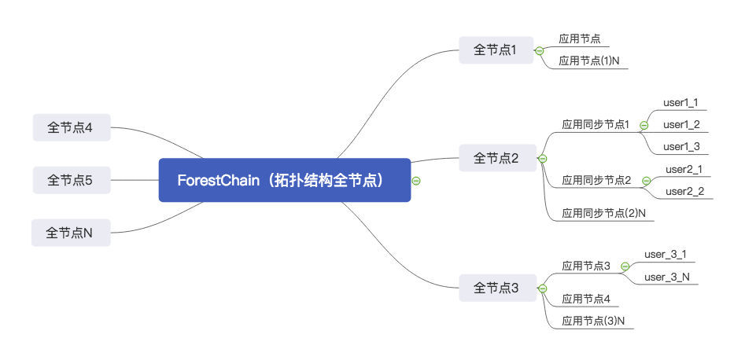
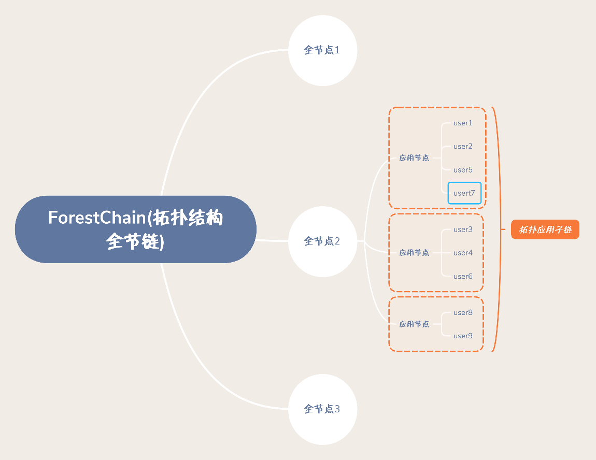
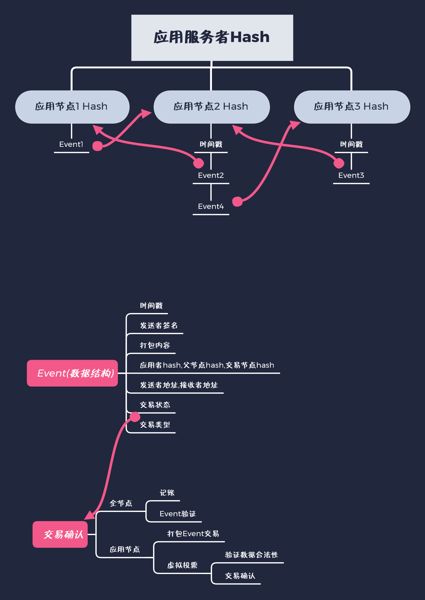

# ForestChain

#### 介绍
森林链
为了解决区块链的应用难的问题，开发出简单、高效、安全、高并发区块链框架由为重要。
森林链应运而生，森林链为企业、互联公司提供一个安全广扩的土壤。让它们自由的播种，让种子安全的长大成苍天大树！
#### 软件架构
软件架构说明
 
ForestChain基于p2p通信，实现双层拓扑结构网络通信。
1.  全节点同步共识全网数据，由无限个节点组成区块链网络。
2.  应用节点服务于用户，节点越多Tps越高，轻松实现百万级区块链服务。
#### 全节点与应用节点架构说明
 
全节点是ForestChain(森林链)的土壤。
1.  全节点负责全链的共识与数据的同步，拥有区块链的记账权，验证应用节点合法性。同时全节点也是一个路由，应用节点连接上全节点组成一个集群，这样全节点就会组成一条子链。
2.  子链是应用服务的基础数据，相同全节点下的应用节点互相同步数据。每的子链的数据都是经过加密，不在同一全节点下的应用节点并不能同步与解密其它节点的数据。
#### 应用服务开发与Event(单元)数据结构
 
全节点基于CA证书认证，申请CA证书连接...
1.  CA 证书生成用于生成应用服务者Hash值，CA 证书会应用在子链上应用服务核心中单元(Event)打包的内容进行加密。
所以证书代表着企业开发者数据安全身份，同时也加密企业所有数据。对于企业来说数据是私有的，其它人即使盗数据也无法解密。只有使用申请的CA证书才能解密子链数据。
2.  基于HashGraph原理，进行改进的（HashService）。HashService数据使用有向无环设计，可满足多节点接入扩展与高并发的实现。
3.  Event数据以时间戳为有向单位，获取最新时间戳就可以得到最新Event数据。
4.  如何交易确认? 使用虚拟投票共识机制。验证Event单元数据的合法性，投票结束满足2/3就可以认为交易合法。全节点对投票结束进行记账，然后子链应用服务共识与同步。
